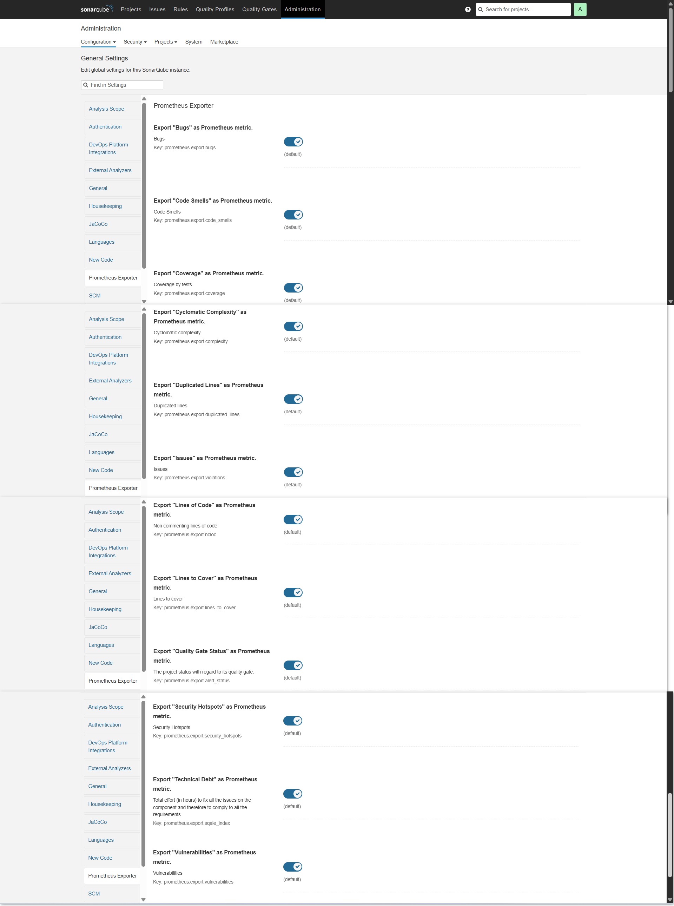
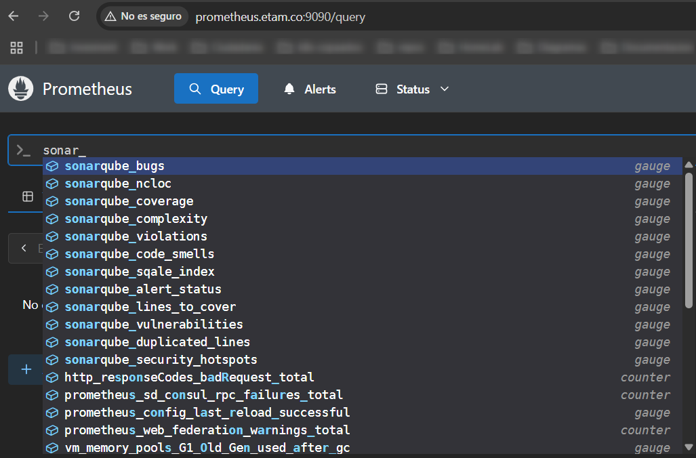
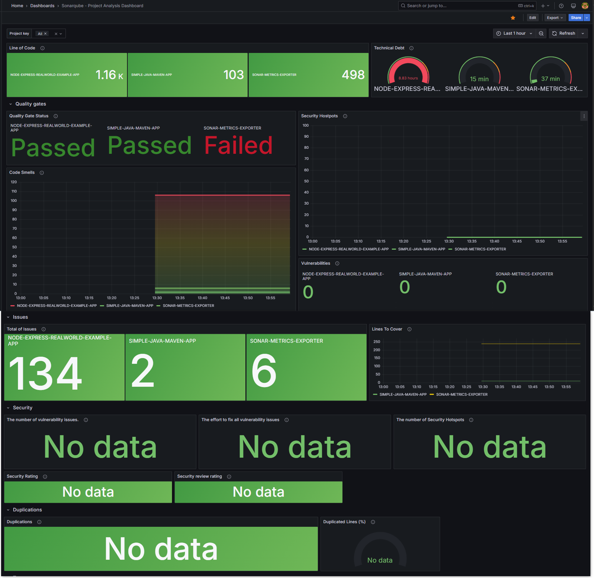

<h1 align="center">Sonarqube Prometheus Exporter</h1>
<h4 align="center">Prometheus Exporter Plugin for SonarQube.</h4>


<p align="center">
  <a href="#features">Features</a> •
  <a href="#requirements">Requirements</a> •
  <a href="#installation">Installation</a> •
  <a href="#usage">Usage</a> •
  <a href="#metrics">Metrics</a> •
  <a href="#screenshots">Screenshots</a>
</p>

## Features
* Configure which metrics to export

## Requirements
* SonarQube 9.x

## Installation

1. Download [latest snapshot release](https://github.com/DomGiorda/sonarqube-prometheus-exporter/releases/tag/v1.0.0-SNAPSHOT-2018-07-04)
2. Drop `sonar-prometheus-exporter-1.0.0-SNAPSHOT.jar` into `$SONARQUBE_HOME/extensions/plugins`.
3. Restart the SonarQube server.

## Usage

1. Configure which metrics you want to export under Administration &rarr; Configuration &rarr; General Settings &rarr; Prometheus Exporter
2. Add a scrape config to your Prometheus instance similar to this:
```yaml
scrape_configs:
  - job_name: 'sonarqube'
    metrics_path: '/api/prometheus/metrics'
    static_configs:
      - targets: ['localhost:9000']
```
3. Alternatively, point your HTTP client to `http://localhost:9000/api/prometheus/metrics`
4. You can export the dashboard from this file:
```bash
  resources/grafana_dashboard.json
```

## Metrics

1. Wich metrics can you export?
This section outlines the key metrics related to code quality and analysis that can be exported from SonarQube:

* **NCLOC:** Stands for Non-Commented Lines of Code, representing the actual lines of source code excluding comments and blank lines.
* **BUGS:** Identifies coding errors that can lead to unexpected behavior or runtime issues.
* **VULNERABILITIES:** Highlights security weaknesses in the code that could be exploited.
* **CODE_SMELLS:** Points out maintainability issues that make the code harder to understand, modify, or extend.
* **COVERAGE:** Measures the percentage of code lines, branches, or conditions exercised by automated tests.
* **TECHNICAL_DEBT:** An estimation of the effort required to fix all Code Smells and maintainability issues, often expressed in time.
* **COMPLEXITY:** Typically refers to Cyclomatic Complexity, which measures the number of independent paths through the code, indicating how difficult it is to test and understand.
* **LINES_TO_COVER:** The number of executable lines of code that could potentially be covered by tests.
* **VIOLATIONS:** A general term referring to any instance where the code breaks a defined quality rule (encompassing Bugs, Vulnerabilities, and Code Smells).
* **ALERT_STATUS:** Indicates the overall quality gate status of the project (e.g., Passed or Failed), based on predefined conditions for key metrics.
* **SECURITY_HOTSPOTS:** Highlights security-sensitive pieces of code that require manual review to determine if a vulnerability exists.
* **DUPLICATED_LINES:** Shows the percentage or number of code lines that are identical or very similar to other code blocks, often indicating a need for refactoring.
* **LINES** Show the total count of lines in your project.       

## Screenshots
<p align="center">
  
  
  
</p>
