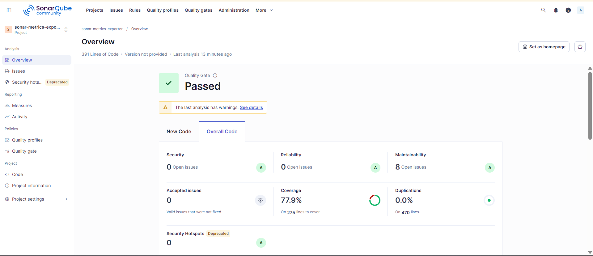
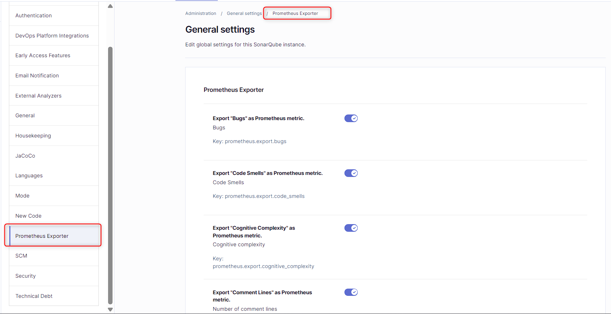
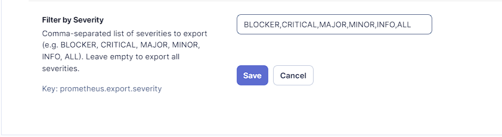
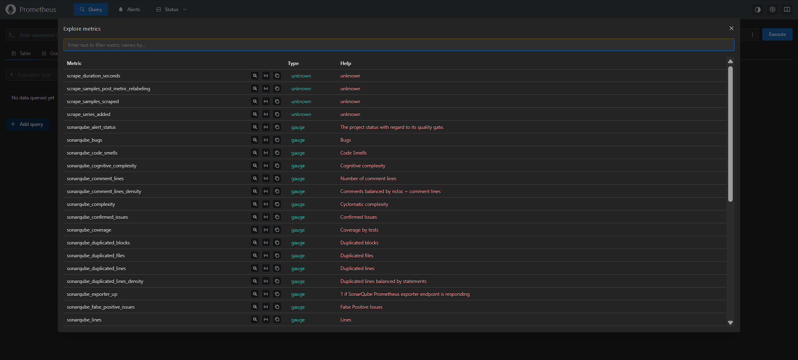
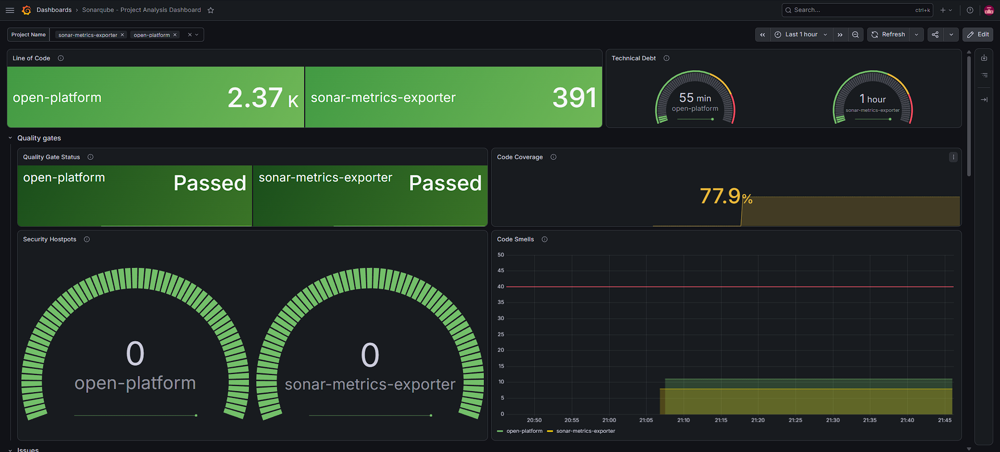

<div align="center">
  
  <h1>SonarQube Metrics Exporter</h1>
  <p><strong>Metrics Exporter Plugin for SonarQube</strong></p>

  <p>
    <a href="https://sonarcloud.io/summary/new_code?id=DomGiorda_sonar-metrics-exporter"></a>
    <a href="https://sonarcloud.io/summary/new_code?id=DomGiorda_sonar-metrics-exporter"></a>
    <a href="https://sonarcloud.io/summary/new_code?id=DomGiorda_sonar-metrics-exporter"></a>
    <a href="https://sonarcloud.io/summary/new_code?id=DomGiorda_sonar-metrics-exporter"></a>
    <a href="https://sonarcloud.io/summary/new_code?id=DomGiorda_sonar-metrics-exporter"></a>
  </p>

  <p>
    <a href="https://github.com/DomGiorda/sonar-metrics-exporter/releases"></a>
    <a href="https://github.com/DomGiorda/sonar-metrics-exporter/releases"></a>
    <a href="LICENSE"></a>
  </p>

  <p>
    <a href="#whats-new-in-version-310"><b>What's New</b></a> •
    <a href="#features"><b>Features</b></a> •
    <a href="#requirements"><b>Requirements</b></a> •
    <a href="#installation"><b>Installation</b></a> •
    <a href="#usage"><b>Usage</b></a> •
    <a href="#metrics"><b>Metrics</b></a> •
    <a href="#screenshots"><b>Screenshots</b></a>
  </p>
</div>

---

## 🚀 What's New in Version 3.1.0
We are thrilled to announce **Version 3.1.0**, featuring full rebranding to **SonarQube Metrics Exporter**, optimized package naming, and unversioned asset distribution for streamlined deployments:

- **Rebranded Plugin & Artifact**: Renamed plugin key to `metrics-exporter` and default artifact distribution to `sonar-metrics-exporter.jar`.
- **Upgraded Compatibility**: Guaranteed support for the new SonarQube `2026.x` (`26.2.0.x`) platform architecture.
- **Extensive Metrics Expansion**: Supported over 20 metrics (tests, skipped, errors, failures, maintainability ratings, security hotspots, code coverage, debt ratio).
- **Branch-Aware Metrics Export**: Dynamic branch resolution with `branch` label support across Prometheus metrics.
- **Granular Severity Filtering**: Filter severity-specific metrics via `?severity=BLOCKER,CRITICAL` or SonarQube Administration.

---

## ✨ Features
- **Flexible Configuration**: Configure exactly which metrics you want to export via the SonarQube UI.
- **Prometheus Integration**: Exposes a `/api/prometheus/metrics` endpoint that Prometheus can easily scrape.
- **Grafana Ready**: Includes a pre-configured Grafana dashboard template for instant observability.
- **Branch Support**: Multi-branch metrics for complete visibility.

---

## 📋 Requirements
**Supported SonarQube versions (compatibility)**

| SonarQube version | Notes |
| :--- | :--- |
| **9.x** | Supported (stable) — builds against plugin API 9.4.x for broad compatibility |
| **10.8** | Supported — tested compilation against SonarQube 10.8 artifacts |
| **25.10** | Supported — tested for compatibility with SonarQube 25.10 |
| **2026.1 / 2026.2** | **Supported — tested against sonar-ws 26.2.0.119303** |

> **Note:** If you need to target a specific SonarQube runtime, check `pom.xml` properties (`sonar.apiVersion` and `sonar.pluginApiVersion`) and build accordingly.

---

## 💾 Installation

1. Download the latest release JAR:
   ```bash
   wget https://github.com/DomGiorda/sonar-metrics-exporter/releases/download/v3.1.0/sonar-metrics-exporter.jar
   ```
   Or browse the [latest releases page](https://github.com/DomGiorda/sonar-metrics-exporter/releases/latest).

2. Drop `sonar-metrics-exporter.jar` into the `$SONARQUBE_HOME/extensions/plugins` directory.
3. Restart your SonarQube server.

---

## 🛠️ Usage

### 1. Configuration
Configure which metrics you want to export under **Administration** &rarr; **Configuration** &rarr; **General Settings** &rarr; **Prometheus Exporter**.

### 2. Prometheus Scrape Configuration
Add a scrape config to your Prometheus instance similar to this:
```yaml
scrape_configs:
  - job_name: 'sonarqube'
    metrics_path: '/api/prometheus/metrics'
    # basic_auth:
    #   username: 'admin'
    #   password: '<your-password>'
    # OR:
    # bearer_token: '<your-sonarqube-user-token>'
    static_configs:
      - targets: ['localhost:9000']
```

### 3. API Endpoint
Alternatively, point your HTTP client to `http://localhost:9000/api/prometheus/metrics`.
- You can filter metrics by severity directly via query parameter: 
  `http://localhost:9000/api/prometheus/metrics?severity=BLOCKER,CRITICAL`
- Or configure default severities under **Administration** &rarr; **Configuration** &rarr; **General Settings** &rarr; **Prometheus Exporter** &rarr; **Filter by Severity**.

### 4. Grafana Dashboard
You can import the sample dashboard from this file:
```bash
resources/grafana_dashboard.json
```

> **Note:** The provided `grafana_dashboard.json` is a base template intended to help you quickly get started. Depending on your Grafana configuration, version, and custom panel customizations, the visual appearance may differ from the dashboard screenshot shown below.

### 5. Prometheus Configuration Examples
Prometheus configuration examples are available under `./resources/prometheus/` in this repository (for example `./resources/prometheus/prometheus.yml`). If you used the `docker-compose.yml` in the repo root, a sample Prometheus config is also provided at `./prometheus/prometheus.yml`.

---

## 📊 Metrics

This section outlines the key metrics related to code quality and analysis that can be exported from SonarQube. The exporter also adds a `severity` label when severity-specific metrics are detected (for example `BLOCKER`, `CRITICAL`, `MAJOR`, `MINOR`, `INFO`). This allows filtering in Grafana/Prometheus using the `severity` label (e.g. `sonarqube_vulnerabilities{severity="CRITICAL"}`).

| Metric | Description |
| :--- | :--- |
| **`NCLOC`** | Stands for Non-Commented Lines of Code, representing the actual lines of source code excluding comments and blank lines. |
| **`BUGS`** | Identifies coding errors that can lead to unexpected behavior or runtime issues. |
| **`VULNERABILITIES`** | Highlights security weaknesses in the code that could be exploited. |
| **`CODE_SMELLS`** | Points out maintainability issues that make the code harder to understand, modify, or extend. |
| **`COVERAGE`** | Measures the percentage of code lines, branches, or conditions exercised by automated tests. |
| **`TECHNICAL_DEBT`** | An estimation of the effort required to fix all Code Smells and maintainability issues, often expressed in time. |
| **`COMPLEXITY`** | Typically refers to Cyclomatic Complexity, which measures the number of independent paths through the code, indicating how difficult it is to test and understand. |
| **`LINES_TO_COVER`** | The number of executable lines of code that could potentially be covered by tests. |
| **`VIOLATIONS`** | A general term referring to any instance where the code breaks a defined quality rule (encompassing Bugs, Vulnerabilities, and Code Smells). |
| **`ALERT_STATUS`** | Indicates the overall quality gate status of the project (e.g., Passed or Failed), based on predefined conditions for key metrics. |
| **`SECURITY_HOTSPOTS`** | Highlights security-sensitive pieces of code that require manual review to determine if a vulnerability exists. |
| **`DUPLICATED_LINES`** | Shows the percentage or number of code lines that are identical or very similar to other code blocks, often indicating a need for refactoring. |
| **`LINES`** | Show the total count of lines in your project. |
| **`TEST_SUCCESS_DENSITY`** | % of tests that pass. |
| **`TESTS`** | Total number of unit tests. |
| **`TEST_FAILURES`** / **`TEST_ERRORS`** | Broken tests vs errors. |
| **`SKIPPED_TESTS`** | Ignored tests. |
| **`NEW_BUGS`** / **`NEW_VULNERABILITIES`** / **`NEW_CODE_SMELLS`** | Metrics only for new code (new code period). |
| **`NEW_COVERAGE`** | Coverage on new code. |
| **`NEW_DUPLICATED_LINES_DENSITY`** | Duplicated lines density on new code. |
| **`NCLOC_LANGUAGE_DISTRIBUTION`** | LOC distribution by language. |
| **`SQALE_DEBT_RATIO`** | Technical debt ratio as a % of total development cost. |
| **`SQALE_RATING`** | Maintainability rating (A–E). |
| **`RELIABILITY_RATING`** / **`SECURITY_RATING`** | Equivalent ratings for bugs and vulnerabilities. |
| **`SECURITY_HOTSPOTS_REVIEWED`** | % of reviewed hotspots. |
| **`SECURITY_HOTSPOTS_REVIEWED_STATUS`** / **`SECURITY_HOTSPOTS_TO_REVIEW_STATUS`** | Review status breakdowns. |

### 🌿 Branch Tracking
The exporter includes a `branch` label for dimensional tracking in Prometheus/Grafana (e.g. `sonarqube_bugs{project="mi-app", branch="main"}`). If the SonarQube instance supports the branches API, all available branches are queried and exposed. For Community Editions without branch support, the `branch` label defaults to `"main"`.

---

## 📸 Screenshots

<div align="center">
  
  <br/>
  
  <br/>
  
  <br/>
  
  <br/>
  
</div>
